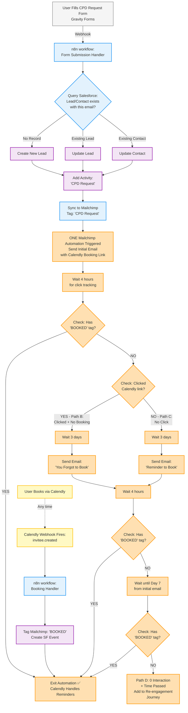

# CPD Outreach Automation Flow

## System Overview

This workflow automates the CPD (Continuing Professional Development) booking process from initial request to booking confirmation, with automated follow-up sequences based on user behavior using event-driven architecture.

#### CPD Schedule:\*\* Weekly sessions, Mon-Fri 11:30-14:30

#### Automation Window:\*\* 7-day cycle aligned with weekly CPD offerings

#### Current Conversion:\*\* 2/50 (4%) - Goal: Increase bookings through automated follow-up

### Tech Stack

- **Gravity Forms** (Website CPD request form)
- **n8n** (Automation orchestrator)
- **Salesforce** (CRM - Leads & Contacts)
- **Mailchimp** (Email marketing - **ONE combined automation with conditional branching**)
- **Calendly** (Booking platform with weekly time slots)
- **Calendly SF Integration** (AppExchange package - backup/visibility)

---

## Complete Flow Diagram



---

## n8n Workflows

### Workflow 1: Form Submission Handler

**Trigger:** Gravity Forms webhook (CPD request form submitted)

**Actions:**

1. Receive JSON payload from Gravity Forms
2. Query Salesforce objects (Lead & Contact) by email address
3. **Conditional Logic:**
   - **If no record exists** → Create new Lead in Salesforce
   - **If Lead exists** → Update existing Lead
   - **If Contact exists** → Update existing Contact
4. Add Activity to Lead/Contact: "CPD Request"
5. Add/Update subscriber in Mailchimp
6. Apply Mailchimp tag: **"CPD Request"**

**Result:** Lead/Contact created/updated in SF and synced to Mailchimp, triggering ONE automation

---

### Workflow 1: Calendly Booking Handler

**Trigger:** Calendly webhook (invitee.created event)

**Actions:**

1. Receive booking data from Calendly (email, event date, event type)
2. Search Salesforce for Lead or Contact by email
3. Add Mailchimp tag: **"BOOKED"** (exits automation immediately)
4. Check if Event exists on Lead/Contact in Salesforce
5. If no Event exists, create Event/Activity in Salesforce (backup for SF Integration)

**Result:** Mailchimp automation stops all reminders, SF has visibility, Calendly handles appointment reminders

---

## ONE Mailchimp Automation - Complete Flow

### Automation Structure

**Name:** CPD Booking Flow
**Type:** Customer Journey (Standard plan)
**Trigger:** Tag "CPD Request" added
**Max Duration:** 7 days
**Exit Condition:** Tag "BOOKED" added (checked after every email)

### Timeline

```
Day 0 (Hour 0): Initial email sent
Day 0 (Hour 4): Check BOOKED tag + Click behavior → Branch
Day 3: Reminder emails sent (both paths)
Day 3 + 4 hours: Check BOOKED tag again
Day 7: Final check → Re-engagement if no booking
```

---

## User Behavior Paths

### **Path A: Clicked + Booked** ✅

**What happens:**

1. User clicks Calendly link in initial email (Mailchimp tracks click)
2. User selects CPD time slot (weekly, 11:30-14:30) and completes booking
3. **Calendly webhook fires** → invitee.created event sent to n8n
4. **n8n Workflow** triggered:
   - Finds Lead/Contact in Salesforce by email
   - Adds Mailchimp tag: **"BOOKED"**
   - Creates Event in Salesforce (if Calendly SF Integration didn't already)
5. **Mailchimp automation** detects "BOOKED" tag → **Exits immediately** (no reminders)
6. **Calendly** handles all appointment reminders for their chosen date/time

**Result:** Success! User booked, all Mailchimp reminders stopped, Calendly sends appointment reminders

---

### **Path B: Clicked + No Booking** ⚠️

**What happens:**

1. User clicks Calendly link in initial email (Mailchimp tracks click)
2. User views available CPD time slots but **does not complete booking**
3. User closes Calendly page without booking
4. **Day 3:** Automation checks:
   - User clicked link ✓
   - User does NOT have "BOOKED" tag ✓
5. **"You Forgot to Book" email sent:**
   - Warmer tone (they showed interest)
   - "We noticed you viewed the CPD dates..."
   - Emphasize limited spots, weekly sessions filling up
   - Calendly booking link
6. **Day 3 + 4 hours:** Check for "BOOKED" tag
   - If YES → Exit ✅
   - If NO → Continue to Day 7 check

**Result:** Targeted reminder for warm leads who showed interest

---

### **Path C: No Click** ⚠️

**What happens:**

1. User receives initial email but **never clicks** the Calendly link
2. **Day 3:** Automation checks:
   - User did NOT click link ✓
   - User does NOT have "BOOKED" tag ✓
3. **"Reminder to Book" email sent:**
   - Colder, re-engagement tone
   - Different subject line and angle from Path B
   - Highlight CPD benefits, case studies, social proof
   - Calendly booking link
4. **Day 3 + 4 hours:** Check for "BOOKED" tag
   - If YES → Exit ✅
   - If NO → Continue to Day 7 check

**Result:** Second chance for cold leads who haven't engaged

---

### **Path D: 0 Interaction + Time Passed** ❌

**What happens:**

1. User received both initial email and reminder (Path B or C)
2. **Day 7:** Final automation check:
   - User does NOT have "BOOKED" tag ✓
   - 7 days have passed since initial contact ✓
3. User moved to **re-engagement journey** or exits flow
4. **Note:** This is based on **arbitrary 7-day window**, NOT an "event date" (since they never booked, there's no event date to reference)

**Options for re-engagement:**

- Add tag for general CPD nurture campaign
- Survey to understand barriers
- Add to monthly CPD newsletter
- Exit and clean up

**Result:** User exits primary booking flow after full 7-day cycle

**Key Correction:** Path D is NOT "event passed" - it's a time-based threshold since no event was ever selected.

---

## System Flow Summary

1. **User submits form** → n8n workflow → SF + Mailchimp ("CPD Request" tag)
2. **ONE Mailchimp automation triggered** → Send initial email with Calendly link
3. **User books** (any time) → Calendly webhook → n8n workflow → "BOOKED" tag → Automation exits
4. **OR User doesn't book** → Day 3 reminders (Path B or C based on click behavior)
5. **Still no booking** → Day 7 final check → Re-engagement
6. **Calendly handles** → All appointment reminders for booked sessions
7. **SF maintains** → Complete visibility of all requests, bookings, and events
