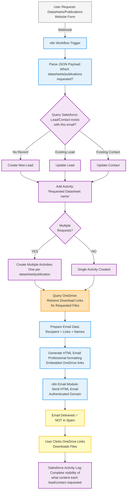

# Datasheet and Publications Automation Flow

## System Overview

This workflow automates the delivery of datasheets and publications from website requests to email delivery, eliminating spam issues caused by MailChimp's multi-link emails while maintaining full CRM tracking and visibility.

#### Current Problem:\*\* MailChimp emails with multiple download links flagged as spam (poor deliverability)

#### Proposed Solution:\*\* Migrate to single n8n workflow + OneDrive + direct HTML email sending

#### Goal:\*\* 100% email deliverability for datasheet/publication requests with full Salesforce tracking

### Tech Stack

- **Gravity Forms / Website Form** (Datasheet/publication request form)
- **n8n** (Automation orchestrator - 1 workflow handles everything)
- **Salesforce** (CRM - Leads & Contacts with Activity tracking)
- **OneDrive** (Centralized storage for all datasheets and publications)
- **n8n Email Module** (Direct HTML email sending from workflow)

---

## Complete Flow Diagram



---

## n8n Workflow

### Single Workflow: Datasheet & Publications Request Handler

**Trigger:** Website form webhook (datasheet/publication request submitted)

**Actions:**

1. **Receive JSON payload** from website form
2. **Parse request data:** Which datasheets and/or publications were requested (array of items)
3. **Query Salesforce** objects (Lead & Contact) by email address
4. **Conditional Logic:**
   - **If no record exists** → Create new Lead in Salesforce
   - **If Lead exists** → Update existing Lead
   - **If Contact exists** → Update existing Contact
5. **Add Activities to Lead/Contact:**
   - For each requested datasheet: "Requested Datasheet: [Datasheet Name]"
   - For each requested publication: "Requested Publication: [Publication Name]"
6. **Query OneDrive** for download links:
   - Match requested file names to OneDrive file paths
   - Retrieve shareable download links
7. **Prepare email data:**
   - Recipient email address
   - Array of requested items with names and links
   - Lead/Contact ID for reference
8. **Generate HTML email:**
   - Professional HTML template with company branding
   - Clear headings for datasheets vs. publications
   - Individual buttons/links for each requested file
   - Mobile-responsive formatting
9. **Send email via n8n Email Module:**
   - Authenticated sending domain
   - SPF/DKIM configured
   - Direct SMTP sending (NOT MailChimp)

**Result:** Complete end-to-end automation in a single workflow - Lead/Contact created/updated in SF with detailed activity tracking, download links retrieved, and professional HTML email delivered to inbox

---

## User Behavior Paths

### **Path A: Single Datasheet Request** ✅

**What happens:**

1. User visits website and submits form requesting **one datasheet** (e.g., "Steel Corrosion Guide")
2. **n8n Workflow** triggered:
   - Finds or creates Lead/Contact in Salesforce
   - Adds Activity: "Requested Datasheet: Steel Corrosion Guide"
   - Queries OneDrive for "Steel Corrosion Guide.pdf"
   - Retrieves shareable download link
   - Generates HTML email with single download button
   - Sends email from authenticated domain via n8n Email Module
3. User receives email in **inbox** (not spam) ✅
4. User clicks download link → OneDrive serves file
5. **Salesforce maintains** complete activity log

**Result:** Successful delivery, user downloads file, full CRM tracking

---

### **Path B: Multiple Datasheets & Publications** ✅

**What happens:**

1. User visits website and submits form requesting:
   - **2 datasheets:** "Steel Corrosion Guide" + "Installation Best Practices"
   - **1 publication:** "Galvanized Steel in Construction Q1 2024"
2. **n8n Workflow** triggered:
   - Finds or creates Lead/Contact in Salesforce
   - Adds **3 separate Activities:**
     - "Requested Datasheet: Steel Corrosion Guide"
     - "Requested Datasheet: Installation Best Practices"
     - "Requested Publication: Galvanized Steel in Construction Q1 2024"
   - Queries OneDrive for all 3 files
   - Retrieves 3 shareable download links
   - Generates HTML email with **3 organized download buttons:**
     - Section 1: Datasheets (2 buttons)
     - Section 2: Publications (1 button)
   - Sends email from authenticated domain via n8n Email Module
3. User receives email in **inbox** (not spam) ✅
4. User clicks download links → OneDrive serves files
5. **Salesforce maintains** detailed activity log showing exactly which content this lead is interested in

**Result:** Successful delivery, user downloads all files, granular CRM insights

---

### **Path C: Publication Request** ✅

**What happens:**

1. User visits website and submits form requesting **one publication** (e.g., "Annual Industry Report 2024")
2. **n8n Workflow** triggered:
   - Finds or creates Lead/Contact in Salesforce
   - Adds Activity: "Requested Publication: Annual Industry Report 2024"
   - Queries OneDrive for "Annual Industry Report 2024.pdf"
   - Retrieves shareable download link
   - Generates HTML email with single download button
   - Customized copy for publication requests (vs. datasheet requests)
   - Sends email from authenticated domain via n8n Email Module
3. User receives email in **inbox** (not spam) ✅
4. User clicks download link → OneDrive serves file
5. **Salesforce maintains** activity log

**Result:** Successful delivery, user downloads publication, full CRM tracking

---

## Technical Implementation Details

### OneDrive Storage Structure

**Centralized Repository:**

- **Folder 1:** `/Datasheets/` - All product datasheets
- **Folder 2:** `/Publications/` - Quarterly reports, industry guides, case studies
- **Naming Convention:** Consistent file names matching form options exactly
- **Shareable Links:** Each file has a public shareable link (view/download only)
- **Access Control:** Connected to Salesforce account, managed by admin team

**Benefits:**

- Single source of truth for all downloadable assets
- Easy to update files (update OneDrive → link stays the same)
- No need to upload files to multiple platforms
- Version control and file history

---

### Salesforce Activity Tracking

**Activity Creation:**

- Every request generates at least **1 Activity** on the Lead/Contact record
- Multiple requests generate **multiple Activities** (one per item)
- Activity format:
  - **Datasheet:** "Requested Datasheet: [Datasheet Name]"
  - **Publication:** "Requested Publication: [Publication Name]"

**Benefits:**

- **Lead Scoring:** See which content each lead is most interested in
- **Lead Qualification:** Technical datasheets = higher intent
- **Segmentation:** Target follow-up campaigns based on content interest
- **Reporting:** Identify most popular datasheets/publications

**Example Activity Log:**

```
Contact: John Smith (Architect, ABC Construction)
- Requested Datasheet: Steel Corrosion Guide (Jan 15, 2024)
- Requested Datasheet: Installation Best Practices (Jan 15, 2024)
- Requested Publication: Case Study Collection (Feb 2, 2024)
- CPD Request (Feb 10, 2024)
```

**Insight:** John is highly engaged, interested in technical details, likely a qualified lead

---

### Email Deliverability Improvements

**Why MailChimp Failed:**

- Multiple download links in one email = spam filter red flag
- MailChimp's shared sending infrastructure has reputation issues
- Generic email templates flagged by modern spam filters

**Why New Solution Succeeds:**

1. **Proper Email Authentication:**

   - SPF and DKIM configured for sending domain
   - Sends from company domain (not mailchimp.com)
   - Dedicated sending infrastructure

2. **Professional HTML Email:**

   - Clean, branded design
   - Individual buttons instead of raw links
   - Natural email copy (not marketing spam language)
   - Mobile-responsive formatting

3. **OneDrive Integration:**

   - Links point to trusted Microsoft domain (onedrive.com)
   - No direct file attachments (avoiding attachment spam filters)
   - Files served via secure shareable links

4. **Single-Purpose Transactional Email:**
   - Email is a direct response to user action (not cold marketing)
   - Immediate delivery after form submission (expected by user)
   - Clear, specific content (exactly what user requested)

**Result:** Email lands in inbox, not spam ✅

---

## System Flow Summary

1. **User submits form** → Website webhook → n8n Workflow triggered
2. **n8n Workflow** → Parse request → Find/create Lead/Contact in SF → Add Activities
3. **n8n Workflow** → Query OneDrive → Return shareable download links for requested files
4. **n8n Workflow** → Generate HTML email with download links
5. **n8n Email Module** → Send HTML email via authenticated infrastructure (direct SMTP)
6. **User receives email** → Inbox (not spam) → Downloads files
7. **Salesforce maintains** → Complete activity log → Lead scoring → Segmentation data

**Key Advantages:**

- ✅ 100% inbox delivery (eliminates spam issue)
- ✅ Full CRM tracking and visibility
- ✅ Single workflow handles everything (simpler, easier to maintain)
- ✅ Direct email sending via n8n Email Module (no external dependencies)
- ✅ Centralized OneDrive storage (easy to manage)
- ✅ Granular activity tracking (lead scoring insights)
- ✅ Professional user experience
- ✅ Scalable for future datasheets/publications
